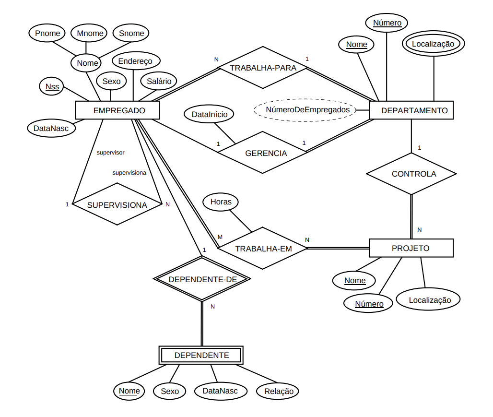
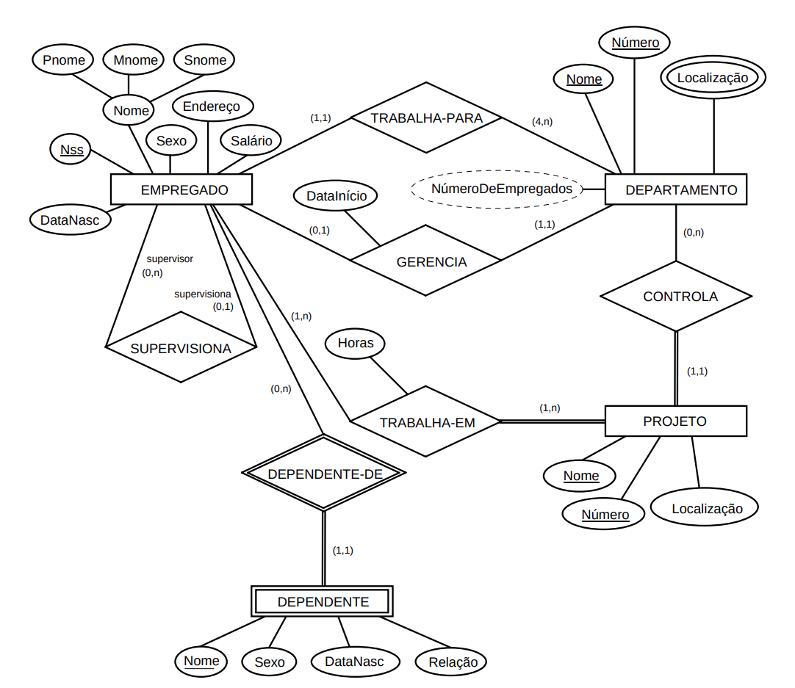

# 4.4 - DER -- Diagrama Entidade Relacionamento

* Entidades em retângulos
* Tipos de relacionamento em losangos
* Atributos em elipses conectadas a entidades ou relacionamentos
* Componentes de atributos compostos em elipses conectadas ao atributo que pertencem
* Atributos multivalorados elipses com linhas duplas de contorno
* Atributos chaves sublinhados
* Atributos derivados em elipses tracejadas
* Tipos de entidade fracas em retângulos com linhas duplas de contorno
* Chave parcial de entidade fraca sublinhada

### Diagrama DER para Companhia

* 

* Restrição de participação parcial em linha simples
* Restrição de participação total (dependência existencial) em linhas duplas
* Nomes do papéis em relacionamentos como SUPERVISIONA

### Diagrama com notação alternativa (restrições estruturais)

* 

