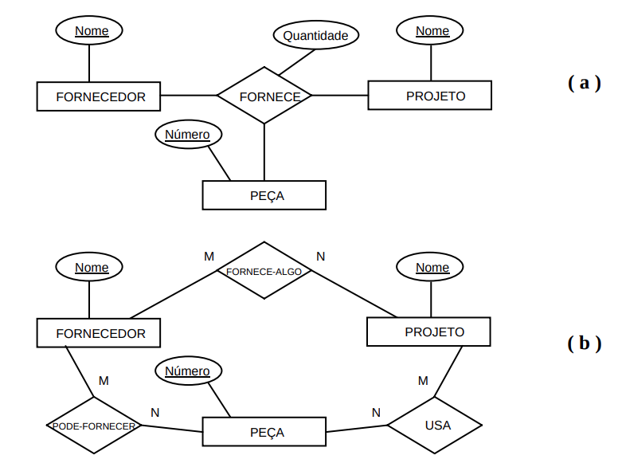
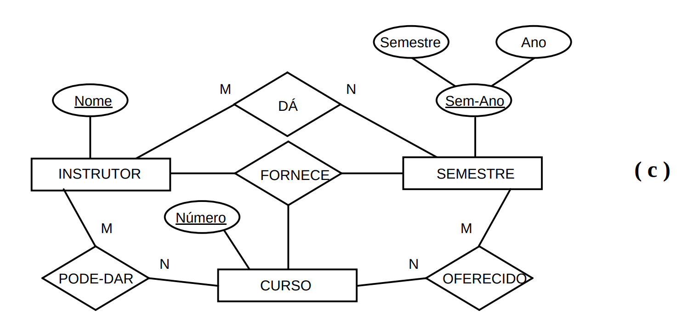
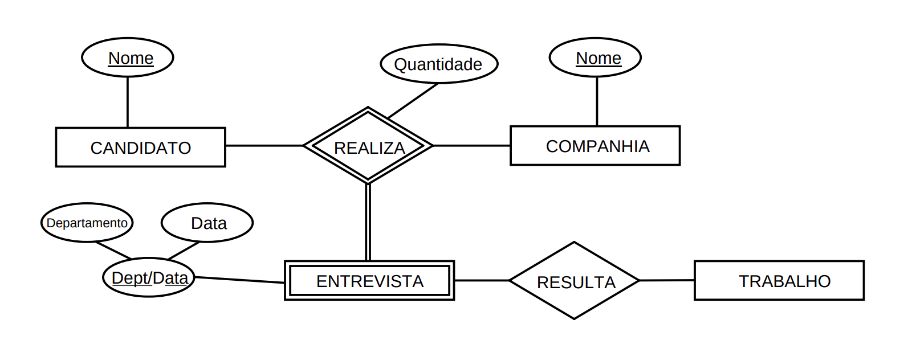

# 4.5 - Tipos de relacionamento com grau maior que dois

* Relacionamento de grau `n` tem `n` arestas no DER, cada uma para um tipo de entidade participante

### Ternário vs. 3 Binários

* Geralmente representam informações diferentes, não são equivalentes
* Exemplo: **(a)** e **(b)** são diferentes
  * 

* Esclarecendo melhor com o exemplo **(c)**

  * 

  * Relacionamento **FORNECE** indica instrutores que oferecem um curso em um dado semestre
    * Instância `(i, s, c)`
  * Relacionamentos binários presentes:
    * **PODE-DAR**: instrutores que PODEM dar um certo curso
    * **DÁ**: instrutores que dão ALGUM curso num semestre
    * **OFERECIDO**: cursos disponíveis em um certo semestre por ALGUM professor
  * Comparando o ternário e os 3 binários:
    * Instância `(i, s, c)` só existe se existirem as instâncias `(i, s)` em DÁ, `(s, c)` em OFERECIDO e `(i, c)` em PODE-DAR
    * Porém a existência de `(i, s)`, `(s, c)` e `(i, c)` não garante a existência de `(i, s, c)`
      * Pois se `(i, s, c)` representa "JEF fornece mac0350 em 01/2020", temos `(i, s)` como "JEF dá um curso em 01/2020" (não necessariamente mac0350, poderia ser mac0110)
        * `(s, c)` seria "mac0350 é oferecido em 01/2020" (mas poderia ser o Gold dando aula)
        * `(i, c)` seria "JEF pode dar mac0350" (mas não necessariamente em 2020, poderia ser em 2021 ou oferecimentos passados)
      * Mas pode-se afirmar como verdadeiro sob a restrição `1:1` no relacionamento PODE-DAR (um instrutor só pode dar aula em um curso e um curso pode ter apenas um instrutor)

### Entidade fraca em relacionamento ternário

* 
  * Pode ter vários tipos de entidades como proprietária da identificação

### Razões de cardinalidade em relacionamento n-ários

* Também se aplicam